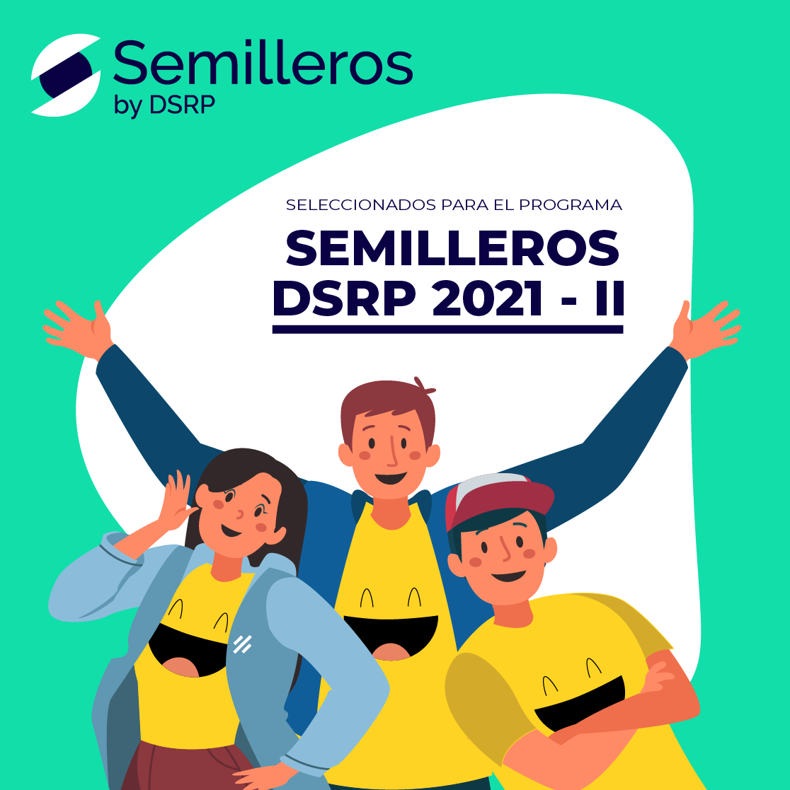

# Semillero por parte de [Data Science Research Perú](https://www.datascience.pe/)
Enfoque o Ruta de: **Intro a Machine Learning y NLP**

Cursos:
* [Intro to Machine Learning](https://www.kaggle.com/learn/intro-to-machine-learning)
* [Introduction to Natural Language Processing](https://courses.analyticsvidhya.com/courses/Intro-to-NLP)

## Proyecto final de aplicación
> # Tachan: Traducción a Tzotzil
> Descripción: [Slides](https://docs.google.com/presentation/d/1kAGMZNpJwQHza3pTTF0VSEG6zOG3PHeD8cF4Apnn6zQ/edit?usp=sharing)